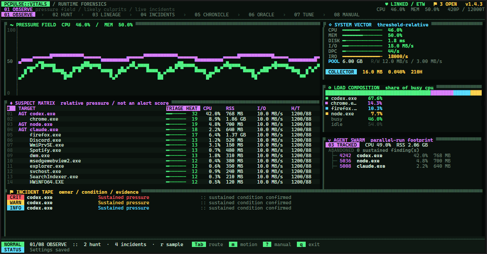
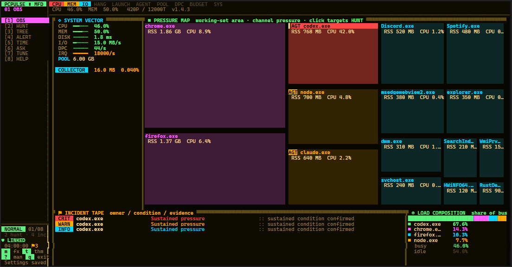
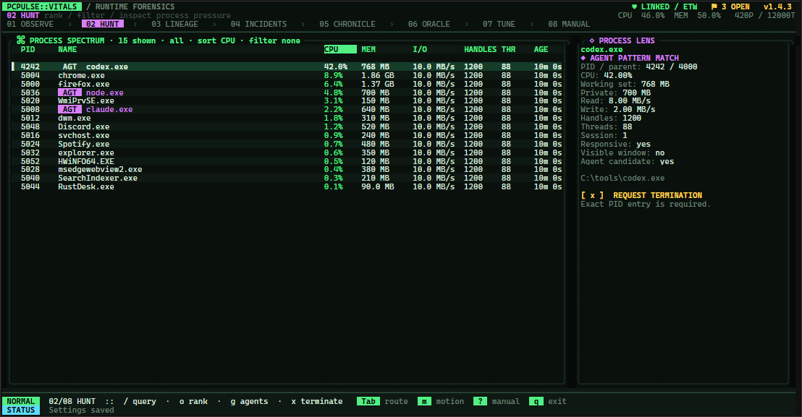
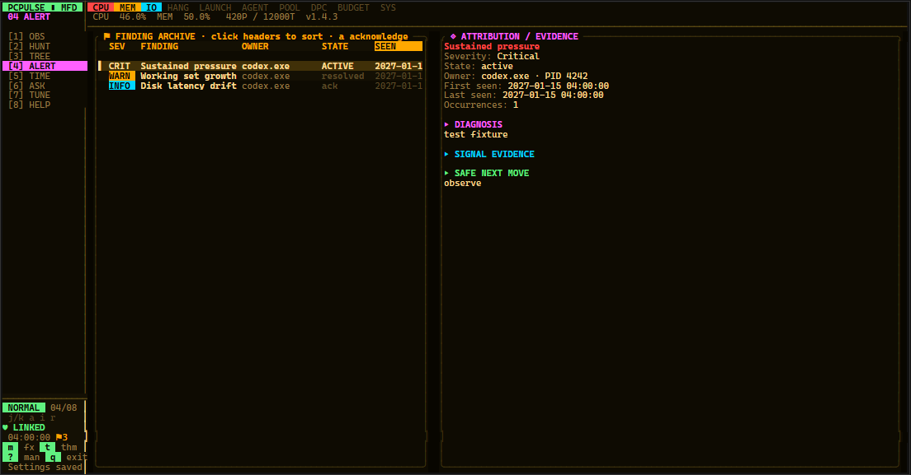
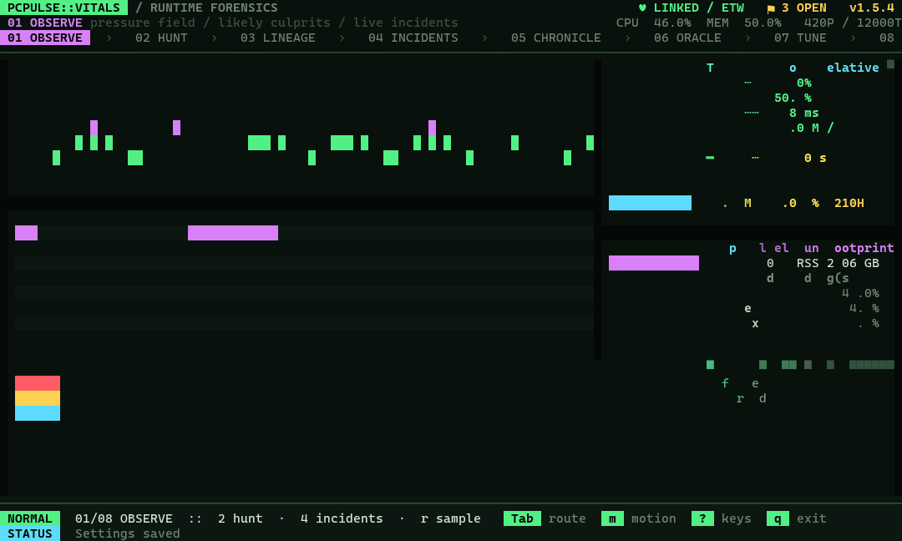
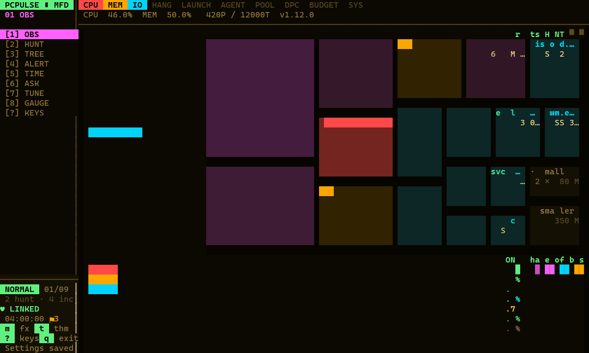
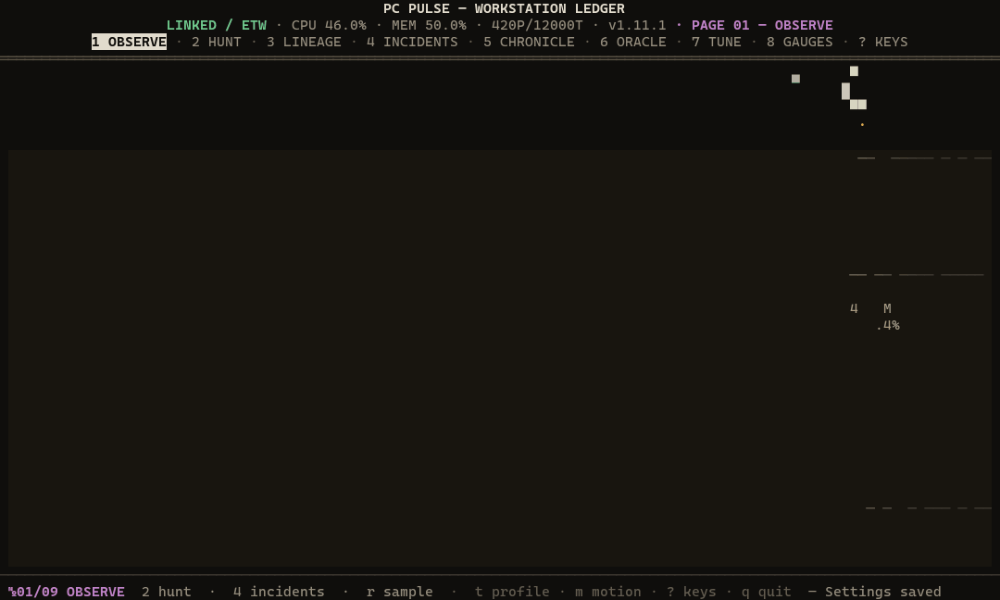
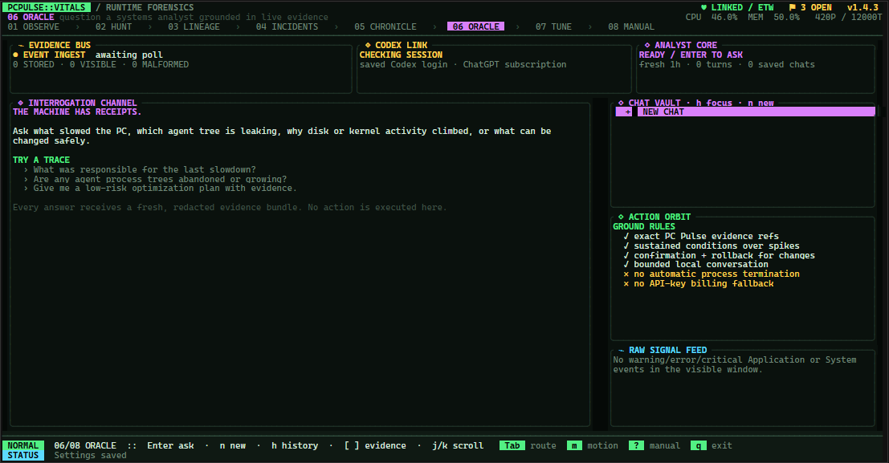

# PC Pulse

<p align="center"></p>

[](https://github.com/quorraa/pc-pulse/actions/workflows/ci.yml)
[](https://github.com/quorraa/pc-pulse/releases/latest)
[](LICENSE)

> Windows 11 x64 only. Built for technical users investigating sustained workstation slowdowns and runaway agent workloads.

PC Pulse is a keyboard-first Windows 11 performance attribution tool for finding the process, agent tree, application, or driver-level condition making a workstation slow. A low-overhead Rust service collects ETW, PDH, Win32, and high-signal Windows Event Log evidence, keeps bounded SQLite history, and serves local clients over a secured named pipe. The primary client is a Ratatui terminal interface; a tiny native helper provides Windows tray notifications.

PC Pulse alerts on sustained conditions and learned baseline deviations, not isolated spikes. It never terminates a process automatically: a manual termination request requires typing the selected process's exact PID, and the service independently enforces confirmation and refuses protected targets.

## Quick start

1. Download `PcPulse-1.17.0-x64.msi` and `SHA256SUMS.txt` from the [latest release](https://github.com/quorraa/pc-pulse/releases/latest).
2. Verify the MSI's SHA-256 hash against the manifest.
3. Install the MSI from an elevated terminal or Explorer.
4. Open **PC Pulse** from Start. The collector runs as the `PcPulseCollector` Windows service.

Release binaries are currently unsigned; Windows may show an unknown-publisher warning, so verify the published checksum before installing.

## What it monitors

- System and per-process CPU, working set, private bytes, handles, threads, and read/write I/O.
- Physical-disk transfer latency, DPC rate, interrupt rate, paged pool, and nonpaged pool — with driver-level ISR/DPC attribution when sustained that repeats its traces, correlates them against device activity, and names the most likely device class with a stated confidence.
- Hung top-level windows, ETW process starts, time to first visible window, parent/child trees, and detached idle agent processes.
- Hardware temperatures and clocks — ACPI thermal zones, effective CPU frequency, and NVIDIA GPU temperature/clocks/utilization — best-effort by hardware and driver support, sampled every five seconds.
- Its own collector against absolute budgets (25 MB working set, a configurable CPU ceiling defaulting to 0.2%, 600 handles) plus mature working-set growth.
- When a handle or thread leak is flagged, captures which handle types and which modules' threads grew — for any process, system metadata only.
- Redacted warning/error/critical Application and System events, classified and fingerprinted (hardware, storage, graphics, crashes, hangs, resource exhaustion, power, services, networking, agent runtimes).
- Discovers kernel and application crash dumps, triages the bugcheck natively, and — with the Debugging Tools installed — runs WinDbg's full analysis on demand.
- Active and resolved finding history with responsible process where attribution is defensible, supporting evidence, explanation, and safe next actions.
- An optional ambient video background behind every page — any video file, muted, dimmed, and desaturated toward the active theme so severity colors and text stay readable; converted once locally with ffmpeg, and the collector and network are never involved.

If policy denies ETW session creation, the collector continues with PDH and Win32, marks ETW degraded, and retries every minute. See [detector details](docs/detectors.md) for every finding's ownership, evidence, and thresholds, and the [named-pipe protocol](docs/protocol.md) for the IPC contract.

## Terminal interface

The TUI ships three presentation profiles: **vitals** (default), a patient-monitor identity; **avionics**, an amber-CRT multi-function display with a bezel-key rail, an annunciator strip that keeps one lamp per finding class lit from every page, and a pressure-map treemap where every major process is a clickable tile sized by working set and heated by its dominant pressure channel; and **ledger**, a night-edition broadsheet that swaps every box border for typographic rules — a full-width masthead with a printed page index, block-digit headline figures for CPU/MEM/DISK (plus NET and IRQ minor figures on wide terminals), a MARKET strip of per-resource trend tickers with windowed deltas, a MOVERS board naming the processes with the largest CPU and working-set change over the last ~2 minutes, one-line NOTICES at the foot, and a folio line beneath. Start with `PcPulse.exe --theme vitals|avionics|ledger` or cycle live with `t`.

| Vitals (default) | Avionics |
|---|---|
|  |  |
|  |  |

| Vitals tour | Avionics tour | Ledger tour |
|---|---|---|
|  |  |  |



*Screenshots come from the deterministic render gallery (`cargo test -p pcpulse-tui --lib dev_render_gallery -- --ignored` with `PCPULSE_GALLERY_DIR` set).*

Nine views:

1. **Observe** — shared CPU/memory pressure field, multi-resource suspect ranking, threshold vectors, load ribbon, agent footprint, collector budget, incident tape.
2. **Processes** — dense sortable process table, name/path/PID filtering, full process inspector.
3. **Tree** — parent/child ownership for abandoned agent descendants and runaway parallel jobs.
4. **Findings** — active/resolved history with ownership, explanation, evidence, and recommendations.
5. **Timeline** — persisted CPU, memory, and disk-latency charts over configurable windows.
6. **Oracle** — evidence-aware chat with the dedicated systems analyzer and the live Windows diagnostic feed.
7. **Settings** — all detector thresholds and notification state, plain-language explanations, plus per-user CLIENT settings (theme, motion effects, refresh rate, Oracle time budget, update checks).
8. **Gauges** — thermal-zone and GPU temperature meters with live history sparklines, plus CPU/GPU clocks and GPU utilization; degrades to an honest unavailable state when sensors are denied.
9. **Keys** — the complete keyboard reference. This page has no digit key: it sits last in the `Tab` cycle and its tab entry prints `?`; pressing `?` anywhere opens the same reference as an overlay.

Important keys:

| Key | Action |
|---|---|
| `1`–`8`, `Tab`, `Shift-Tab` | Navigate pages; the Keys page has no digit and sits last in the `Tab` cycle |
| `j`/`k`, arrows, `PgUp`/`PgDn` | Move selection |
| `/` | Filter the process table |
| `o` | Cycle CPU/memory/I/O/handle/thread/age/name sorting |
| `g` | Toggle agent-only process focus |
| `x` | Begin a manual termination request; exact PID entry is required |
| `a` | Acknowledge the selected finding |
| `z` | Archive the selected finding — it leaves the default list, lamps, and tapes but keeps detecting; in the archived view, `z` recovers it |
| `v` | Cycle the Findings view: current (active + resolved) / archived only |
| `i` | Investigate the selected finding in Oracle — a new chat opens and the composed question is submitted with the finding's evidence; double-clicking the finding row does the same |
| `[` / `]` | Shorten or lengthen the persisted timeline |
| `Enter` or `/` on Oracle | Ask the embedded systems analyzer |
| `j`/`k`, `PgUp`/`PgDn` on Oracle | Scroll the conversation |
| `[` / `]` on Oracle | Change the fresh evidence window (1–24 hours) |
| `n` or `c` on Oracle | Begin a new chat while retaining the previous session in Chat Vault |
| `h` on Oracle | Focus Chat Vault; use `j`/`k` and `Enter` to restore a previous chat |
| `e` on Oracle | Recall your latest question into the input for editing; `Enter` resubmits it |
| `r` or `F2` in Chat Vault | Rename the selected chat inline; an explicit title is kept even as the conversation grows |
| `d` or `Del` in Chat Vault | Delete the selected chat — press twice to confirm; deleting the active chat starts a fresh one |
| `y` on Oracle | Copy the latest analyzer answer to the Windows clipboard |
| `Esc` while analyzing | Cancel the current Codex run |
| `Enter` / `e` | Edit the selected setting |
| `s` | Save settings |
| `r` | Refresh the current view |
| `m` | Toggle finite TachyonFX motion effects; the choice is saved per user |
| Refresh rate (Settings CLIENT row) | Off (event-driven, default) / 30 / 60 fps, saved per user; 30/60 draws on a fixed cadence with smooth interpolation of meters between telemetry samples, and drops a tier automatically if frames keep exceeding their budget. With a v1.11+ service, smooth mode streams system telemetry live at up to 8 Hz; per-process data stays on the two-second cadence |
| `t` | Cycle presentation profiles (vitals / avionics / ledger); the choice is saved per user |
| `u` | Download and install a newer release when the chrome badge shows one — the first press fetches the MSI and `SHA256SUMS.txt` into Downloads and verifies the SHA-256, the second press opens the installer |
| `?` | Open the keys overlay on top of any page; `Esc`, `?`, or a click closes it (the full Keys page is the `?`-labeled last tab) |
| `q` / `Ctrl-C` | Exit the TUI; the collector continues |
| Left-click | Select tabs, process/tree/finding rows, settings, or the Oracle prompt; clicking a Chat Vault row opens that chat and keeps the vault focused for rename/delete |
| Click any table header | Sort the overview suspects, processes, lineage rows, findings, or settings by that column |
| Mouse wheel | Scroll the active table, finding list, or Oracle conversation; zoom Timeline history |
| Right-click a process | Open the existing typed-PID termination confirmation; never terminate directly |

[TachyonFX](https://docs.rs/tachyonfx/latest/tachyonfx/fx/index.html) motion is finite and event-scoped; start with `PcPulse.exe --no-effects` or press `m` for reduced motion.

`PcPulse.Notify.exe` is a small per-user tray helper that watches the same pipe and notifies only when a new sustained finding appears; the MSI starts it at logon, and notifications can be disabled from Settings. Double-click its tray icon to open `PcPulse.exe`; right-click to exit the helper.

## Oracle

Oracle is a chatbot inside the TUI — press `Enter` on view `6`, type a question, and submit. Every turn receives a fresh, bounded, redacted evidence bundle; answers must cite exact collected references, and no proposed action is ever executed. The collector never invokes AI: the client runs `pcpulse-systems-analyzer` through the user's Codex CLI in an ephemeral read-only sandbox, and requires `codex login status` to report ChatGPT authentication (API-key sessions are refused rather than silently billed). Press `y` to copy the latest answer, `i` on a finding to investigate it in a new chat, and `r`/`d` in Chat Vault to rename or delete sessions. Analyzer failures are logged to `%LOCALAPPDATA%\PcPulse\analyzer-last-error.log` (overwritten on each failure).

For automation, `PcPulse.exe analyze 1` produces a one-shot plan, and `agent-context`, `plan-schema`, `agent-prompt`, and `import-plan` expose the same contract to other agents — see the [systems-analyzer integration guide](docs/agent-integration.md).

## Updates

The TUI checks this repository's GitHub releases for a newer version once per launch, at most every 20 hours, using Windows' bundled `curl.exe` — a client-side courtesy; the collector service never touches the network. When a newer release exists, the chrome shows a quiet `⇡ v1.17.0 available · u` badge: the first `u` downloads the MSI and `SHA256SUMS.txt` to your Downloads folder and verifies the SHA-256 (a file that fails verification is deleted), and the second `u` launches the installer — never silently, never automatically. The "Update checks" row in Settings' CLIENT section switches the check off entirely; when off, no update-related network request is ever made.

## Video background

Any video file — mp4, mkv, webm, gif, whatever — can play as a muted, ambient background behind every page. Frames are rendered as half-block cell pixels, desaturated and dimmed toward the active theme so severity chips, selection bars, and text stay readable. The first time a clip is set, PC Pulse converts it once with `ffmpeg.exe` on PATH (`winget install ffmpeg`, or Chocolatey) into a compact cache at `%LOCALAPPDATA%\PcPulse\backgrounds\*.pulseclip`. Conversion keeps the clip's own resolution and aspect ratio, shrunk only as far as it takes to fit inside the ceiling the quality preset sets — 832x464 by default, so a 1080p source is captured at 825x464 and an SD source keeps every pixel it has rather than being magnified into blocks. At the default that costs roughly 1-4 MB per second of 60 fps video (dense detail costs several times what flat footage does), so a 3-minute clip lands somewhere between 200 MB and 700 MB; a 15-second 30 fps SD clip is about 7 MB. Each step down the preset ladder quarters the pixels and roughly quarters that. After that one-time conversion, playback costs almost nothing: no decode process at runtime, one frame held in memory and decoded only when it changes, and the sampling onto terminal cells is reused between draws until the frame or the window moves. Only one background is ever live, so whenever a clip loads, every other converted clip in that folder is deleted — the folder costs one clip, not every clip and quality you have ever tried. That is also why a quality you used before is not waiting for you when you switch back to it: its cache went the moment the next one loaded. The collector service is never involved and nothing touches the network.

Five CLIENT rows on the Settings page control it: "Background video" (Enter opens the Windows file picker, filtered to video files and starting where the current clip lives; Delete or Backspace turns it off — and if the shell cannot give us a dialog, the row falls back to typing a path), "Background quality" (Enter cycles low 208x116 → medium 416x232 → high 832x464 → ultra 1248x702; only the quality in use is kept on disk, so switching converts the video again at the new size — including switching back to one you used before), "Background" (on/off), "Background dim" (10-60%, how far the clip is darkened toward the theme), and "Background fps" (auto follows the clip's own rate, or 1-60 — the frame-budget guardrail lowers the background's rate before it ever touches UI refresh, shown as e.g. `60 → 30 (auto)`). The background needs at least a 72x20 terminal; below that it stays hidden.

## Build and test

Prerequisites: Windows 11 x64; Rust stable 1.94+ with the MSVC x64 target; Visual Studio Build Tools with the Windows 11 SDK and C++ build tools (for bundled SQLite); .NET SDK 10.0.100+ only to build the WiX MSI — the installed application does not use .NET.

```powershell
cargo test --workspace
cargo clippy --workspace --all-targets -- -D warnings
cargo build --workspace --release
```

Build the three executables, MSI, and SHA-256 manifest (add `-CertificateThumbprint YOUR_SHA1_THUMBPRINT` for a signed release):

```powershell
.\scripts\Build-Release.ps1 -Architecture x64 -Version 1.17.0
```

Outputs land in `artifacts`. `scripts\Measure-CollectorBudget.ps1` validates the collector's resource budgets from an elevated terminal.

Repository layout:

- `src/PcPulse.Service` — Rust service: ETW/PDH/Win32 collectors, detector engine, SQLite, named-pipe server.
- `src/PcPulse.Tui` — Ratatui client, shared pipe client, CLI JSON commands, tray notification helper.
- `installer/PcPulse.Installer` — per-machine WiX MSI.
- `scripts` — release, setup, IPC smoke test, and collector-budget measurement.

## Install and run

```powershell
msiexec.exe /i .\artifacts\PcPulse-1.17.0-x64.msi
```

Open **PC Pulse** from Start, or run `& "$env:ProgramFiles\PC Pulse\PcPulse.exe"`. Verify the service and IPC:

```powershell
Get-Service PcPulseCollector
.\scripts\Test-Pipe.ps1
```

Opening PC Pulse also starts the collector service if it is stopped and brings back the tray helper if it is not running; the tray stays until you exit it from its own right-click menu. The installer grants standard users start-only rights on the service (never stop or configure), so this self-heal needs no elevation — on older installs without the grant, the TUI falls back to a single visible UAC prompt, and declining it simply leaves the offline panel in charge.

For scripts and agent runs, `PcPulse.exe ping | snapshot | alerts | logs 24 | agent-context 1 | analyze 1 | plan | settings` all emit formatted JSON. The development-equivalent service setup is `scripts\Install-Service.ps1`.

Uninstall via Apps > Installed apps, or:

```powershell
msiexec.exe /x .\artifacts\PcPulse-1.17.0-x64.msi
```

For development installs, `scripts\Uninstall-Service.ps1` removes everything; pass `-KeepHistory` to retain `%ProgramData%\PcPulse`.

## Storage, privacy, and security

Everything stays local: bounded SQLite history and service settings in `%ProgramData%\PcPulse` (`history.db`, `settings.json`; configurable 1–365 day retention), per-user chat history and UI preferences in `%LOCALAPPDATA%\PcPulse` (`chat-history.json`, `ui-prefs.json`). Diagnostic event fields are bounded and redacted before persistence — user-profile paths become `%USERPROFILE%` and credential-like values are removed. PC Pulse never collects the Security event log, process command lines, environment variables, file contents, browser data, or keystrokes. The collector has no network path; the client's only network touchpoints are an explicit Oracle question or `analyze` run (which sends the redacted evidence bundle to the user's ChatGPT-authenticated Codex session), an explicit deep crash-dump analysis (Microsoft's public symbol server), and the TUI's rate-limited release update check against GitHub, which is switched off from Settings' CLIENT section. The named pipe rejects remote clients, caps messages at 1 MiB, and grants access only to LocalSystem, administrators, and interactive users; termination requires `confirmed: true` and always refuses PID 0, PID 4, and the collector itself.

## Documentation

- [Detector design](docs/detectors.md) — sustained streaks, baselines, growth windows, attribution limits.
- [Named-pipe protocol](docs/protocol.md) — commands, payloads, and limits.
- [Systems-analyzer integration](docs/agent-integration.md) — Oracle internals, schemas, and external-agent workflow.
